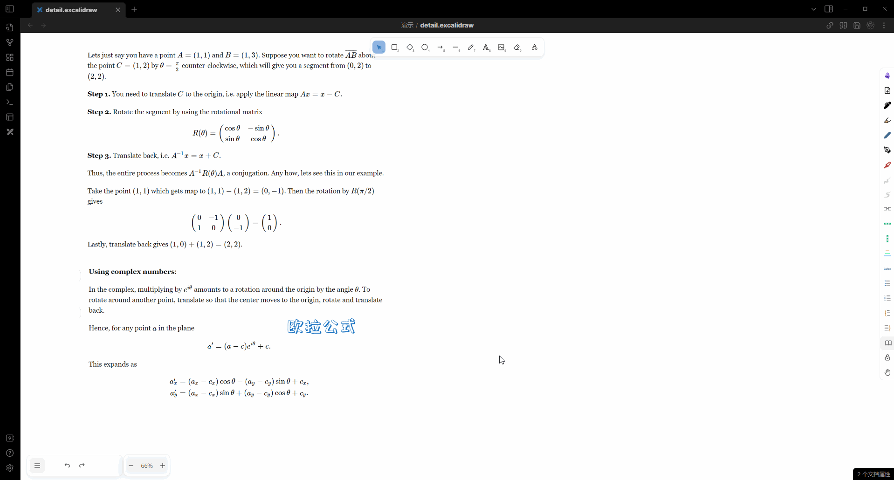

# Obsidian-Excalidraw-ymjr
这个插件是[obsidian-excalidraw-plugin](https://github.com/zsviczian/obsidian-excalidraw-plugin)的修改版本.

[English](../README.md) | [简体中文](./README_ZH.md)

根据我自己的实际需求，当自定义脚本无法满足需求时，对[obsidian-excalidraw-plugin](https://github.com/zsviczian/obsidian-excalidraw-plugin)进行必要的修改。

自定义脚本放在了 [obsidian-excalidraw-scripts](https://github.com/Bowen-0x00/obsidian-excalidraw-scripts) (逐渐上传中...)

obsidian 示例库 [obsidian-excalidraw-example-vault](https://github.com/Bowen-0x00/obsidian-excalidraw-example-vault)中放了一些功能演示。 你也可以看[视频](https://www.bilibili.com/video/BV1zN4y1H7Dx/) 了解部分这些功能。

## 特性
这里只列举需要修改才能实现的功能

搭配自定义脚本可以实现：

- 同时支持多个自定义字体
- 元素支持obsidian tag功能
- 鼠标事件Hook
  - 显示隐藏元素
  - 思维导图展开、折叠
    - 
    - 
  - 表格改变行、列高、宽
  - 缩放一定程度显示、隐藏元素
- 键盘事件Hook
  - 思维导图增加元素
  - 逐帧播放gif
  - 逐个显示、隐藏当前视图中的元素
- 加粗文字
  - 
- 容器中文字首行缩进
- 形状、文字增加渐变
- 形状、文字增加阴影
- 图层功能
  - 
- 修正中文wrap异常
- 增加拖拽点Hook
  - 测量长度功能
- 显示画布缩略图
  - 
- 鼠标悬浮Hook
  - 鼠标悬浮改变阴影 (callout、按钮)
- 统一公式大小以匹配字体大小
  - 
- 引用excalidraw画布的部分并可跳转
- 在形状中播放gif (不是iframe)
- 设置项
  - 自定义所保存附件名称
  - 激光笔设置
  - 是否在导出svg时嵌入字体信息
  - 是否显示所有箭头选项
- 固定元素到屏幕
- 导出/嵌入svg时保持渐变
  - 
- Library分组&按需加载
  - 
  - 
- 拖拽拉伸自定义形状箭头，箭头头不变形
  - 
- 展开/隐藏详情
  - 
- 自动连接功能 (直角连接、附着到连接点)
  - 
  - 
- 代码语法高亮功能
  - 
- Echarts图表.
  - 
- 导出/嵌入svg时渲染本地md、代码高亮、echarts.
  - 

你可以查看演示和更多细节在:
- 我的[B站空间](https://space.bilibili.com/39231346/)

## 安装与使用
### 注意事项
请做好备份工作以保证你的重要内容不会丢失（如内存不足导致的保存异常）。

如：
- git版本控制
- onedrive云同步和版本控制
- 核心插件中的文件恢复插件

### 使用步骤
1. 安装插件。
   1. 方式一（手动安装）：将`main.js`、`manifest.json`、`styles.css`放到插件目录，如`库路径\.obsidian\plugins\obsidian-excalidraw-plugin-ymjr`
   2. 方式二（BRAT自动安装）：
      1. 从插件市场安装BRAT脚本
      2. 在BRAT插件的设置中点击`Add Beta plugin`
      3. 在弹出的github仓库对话框中输入`Bowen-0x00/obsidian-excalidraw-plugin-ymjr`
2. 在OB的第三方插件中，关闭原本的`Excalidraw`，打开`obsidian-excalidraw-plugin-ymjr`。
3. 搭配你需要的功能所对应的脚本使用，脚本放在你插件设置中的`基本 -> Excalidraw自动化脚本的文件夹`所制定的文件夹下。
## 问题、反馈、创意
欢迎联系我，如果：
- 遇到使用问题
- 建议与反馈
- 交流沟通有趣的想法、新的feature

沟通渠道可以是：
- github issue
- 邮件
- B站留言或私信
- 我的个人联系方式 (微信、qq)

## 赞助
如果你觉得我做的这些修改对你有所帮助，欢迎评论、留言。

你也可以赞助我一杯咖啡：
- 微信赞助码 
  
- ko-fi
  

## 感谢
感谢[zsviczian](https://github.com/zsviczian)和[obsidian-excalidraw-plugin](https://github.com/zsviczian/obsidian-excalidraw-plugin)的其他贡献者

感谢[excalidraw](https://github.com/excalidraw/excalidraw)的贡献者
